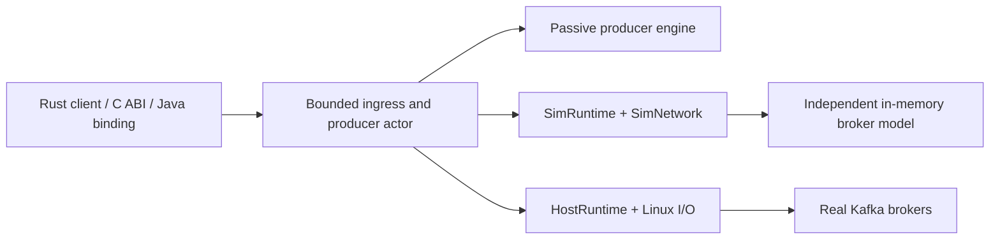

# Kafka producer simulation: Java and Rust

The `dst-client` branch is a working laboratory for understanding and improving
Kafka producer behavior. It brings the existing Java `KafkaProducer` into
deterministic simulation, develops a Rust producer on a runtime designed for
simulation and host execution, and compares their behavior under shared workloads
and failures. DST means **deterministic simulation testing**.

The goal is to make correctness, recovery, resource limits and performance
tradeoffs inspectable: reproduce a run, follow a record through admission and
delivery, explain where it waited or failed, and evaluate a change against the
same experiment. The Rust design also targets efficient real-broker operation;
the simulation reports measure behavior in a modeled environment.

**Start with the [campaign results](rust-runtime-kafka/reports/CAMPAIGN_RESULTS.md),
[Java/Rust comparison tables](rust-runtime-kafka/reports/summaries/COMPRESSION_BATCHING_VARIANTS.md),
or [interactive report index](rust-runtime-kafka/reports/index.html).**

## What this branch is trying to establish

- Exercise the actual Java producer's accumulator, sender, metadata, retries and
  idempotence under controlled timing and failures, with repeatable regression tests.
- Build Rust producer state machines whose ownership, time, randomness, I/O and
  resource budgets are explicit, so the same producer logic can run in simulation
  and against real brokers.
- Compare admission, delivery latency, batching, wire traffic, fairness and
  recovery across implementations. Preserve differences in accepted, refused and
  failed populations so an apparent improvement has an explanation.
- Evaluate individual Rust policies with matched controls: compressed-size batch
  targets, request grouping and partition-pressure admission. Keep failures and
  unfavorable tradeoffs visible in the evidence.

## Results and viewers

The Markdown summaries below render directly on GitHub. **GitHub displays HTML
source rather than running the viewers.** To use the interactive pages, clone or
download this branch and open `rust-runtime-kafka/reports/index.html` in a browser.
The checked-in pages embed their scripts, styles and data; no build, server or raw
simulation histories are needed to view them.

| What to inspect | Read on GitHub | Interactive HTML after checkout |
|---|---|---|
| Campaign scope, totals and acceptance gates | [Complete results](rust-runtime-kafka/reports/CAMPAIGN_RESULTS.md) | [Report index](rust-runtime-kafka/reports/index.html) |
| Java versus Rust across every Full scenario | [Analysis](rust-runtime-kafka/reports/summaries/COMPRESSION_BATCHING_REVIEW.md) · [Every variant](rust-runtime-kafka/reports/summaries/COMPRESSION_BATCHING_VARIANTS.md) · [CSV](rust-runtime-kafka/reports/summaries/COMPRESSION_BATCHING_RESULTS.csv) | [Full comparison gallery](rust-runtime-kafka/reports/classic-full/index.html) |
| Smaller Java/Rust workloads and extra seeds | [Comparison method](rust-runtime-kafka/kafka/kr-kafka-experiments/CLASSIC_COMPARISON.md) | [Test gallery](rust-runtime-kafka/reports/classic-test/index.html) · [Seed 1](rust-runtime-kafka/reports/classic-followup-1/index.html) · [Seed 7](rust-runtime-kafka/reports/classic-followup-7/index.html) |
| Raw versus estimated-wire batch targets in Rust | [Policy review](rust-runtime-kafka/reports/summaries/BATCHING_POLICY_REVIEW.md) · [Every variant](rust-runtime-kafka/reports/summaries/BATCHING_POLICY_VARIANTS.md) | — |
| Sealed versus BrokerReady request grouping in Rust | [Policy review](rust-runtime-kafka/reports/summaries/REQUEST_GATHER_REVIEW.md) · [Every variant](rust-runtime-kafka/reports/summaries/REQUEST_GATHER_VARIANTS.md) | [324-pair request dashboard](rust-runtime-kafka/reports/request-policy/index.html) |
| Healthy-partition progress during another broker's outage | [Admission trial and gates](rust-runtime-kafka/reports/summaries/ADMISSION_TRIAL.md) | [Java/Rust admission comparison](rust-runtime-kafka/reports/classic-full/admission-isolation.html) · [Independent demand](rust-runtime-kafka/reports/admission-independent/index.html) |
| Native admission policies and skewed demand | [Per-run measurements](rust-runtime-kafka/reports/summaries/admission-trial-runs.csv) | [Shared](rust-runtime-kafka/reports/admission-shared/index.html) · [PartitionPressure](rust-runtime-kafka/reports/admission-pressure/index.html) · [Skew](rust-runtime-kafka/reports/admission-skew/index.html) |
| Rust-only timelines, resource usage and delivery outcomes | [Experiment catalogue](rust-runtime-kafka/kafka/kr-kafka-experiments/README.md) | [Native Full gallery](rust-runtime-kafka/reports/native-full/index.html) |

In a paired viewer, Java is blue/solid and Rust is orange/dashed. Choose a
variant and profile, focus the fault window, then inspect offers, admissions,
refusals, acknowledgments, failures and outstanding work together. Shared chart
scales, per-partition views and latency distributions help locate a difference;
the setup panel records the effective configuration and comparison limits.

### Published campaign status

The regenerated measurements are pinned to producer/harness revision
`b65bafb3fc`. Documentation can be read alongside the exact counts and gate
measurements in the [snapshot results](rust-runtime-kafka/reports/CAMPAIGN_RESULTS.md).

| Campaign | Scope | Result |
|---|---|---|
| Java/Rust comparison | 584 Test + 584 Full + 8 extra-seed executions; 588 pairs | All executions passed exact replay |
| Rust batch-target policy comparison | 584 Full + 32 extra-seed executions; 308 pairs | Passed; all 292 default-policy controls reproduced exactly |
| Rust request-grouping comparison | 584 Full + 64 extra-seed executions; 324 pairs | Passed; all 292 default-policy controls reproduced exactly |
| Native catalogue regressions | 146 Test + 146 Full executions | Passed; the Full run supplies the native gallery |
| Native admission trial | 204 executions across seeds 0–15 | Executions passed; two policy acceptance gates failed |
| Native correctness campaign | 515 runs | Passed |

The three comparison rows total **2,440 executions**, each with a repeat execution
for replay verification. Test and Full each cover 37 families and 146 variants
under two profiles. The report snapshot contains 137 HTML pages.

The admission failures are substantive results. The historical Shared baseline
produced 33,872 healthy refusals where its gate requires 33,874. At 32,000 offers/s,
PartitionPressure achieved about 75–81% of Shared's steady acknowledgment
throughput on the tested skewed workloads, below the 95% gate. Its 96 fault runs
had zero healthy outage refusals and zero missing healthy acknowledgment windows.
All 39,198,023 accepted records in the admission trial were acknowledged.
PartitionPressure remains opt-in; the [full results](rust-runtime-kafka/reports/CAMPAIGN_RESULTS.md)
retain the criteria and measurements.

## Java: deterministic testing of the existing client

[`clients-dst`](clients-dst/README.md) is a test-only Gradle module. It constructs
the existing `KafkaProducer`, `Sender`, `RecordAccumulator` and `NetworkClient`
without starting the producer's background I/O thread. A sender pump exposes
`Sender.runOnce()` to a virtual scheduler; a simulated selector supplies network
events. The harness injects a virtual clock and seeded choices for node order,
retry/reconnect jitter and sticky partitioning. Test adapters preserve constructor
configuration, including the actual accumulator's compression levels.

There are two complementary paths:

| Path | Purpose |
|---|---|
| Ordinary `clients-dst` tests | Run the Java producer against Java broker/network fixtures. Cover ordering, idempotence, acknowledged-record preservation, disconnects, delays, broker isolation and exact replay. |
| `clients-dst:classicScenarios` | Use a JDK 25 Foreign Function & Memory (Panama) bridge to run either Java or Rust under one Java workload driver and the same Rust broker, network, catalogue and virtual clock. Produce the cross-client reports linked above. |

The comparison baseline is the Java producer in this checkout. The Rust arm uses
the real native `ProducerClient` and `ProducerActor` through a test bridge. The
imported Rust workspace also includes a separate
[Java FFM producer facade](rust-runtime-kafka/kafka/kr-kafka-java/README.md)
for host execution; the simulation comparison exercises the test bridge rather
than that host-bound facade.

The Java harness deliberately controls concurrency at its test boundaries.
Metadata waits must advance simulation; tests drive the scheduler before
observing completed futures. Blocking on an unfinished `Future.get()` or `flush()`
on the sole simulation thread can deadlock. Keeping these adapters aligned with
production constructor and wait semantics is part of maintaining the harness.

## Rust: a deterministic runtime and a portable producer

[`rust-runtime-kafka`](rust-runtime-kafka/README.md) contains the runtime, reusable
I/O and storage components, Kafka protocol/record machinery, a producer, host
adapters, bindings, simulation models and experiment tools.

### Runtime ownership, time and replay

`SimRuntime` and `HostRuntime` are concrete executors sharing a small task/timer
kernel. Each has one owner and supports local futures that may be `!Send`.
Application actors use a `RuntimeHandle` enum for time, sleeps, spawning and
workload randomness; I/O provider contracts are independent of the executor.

Simulation uses integer virtual time, FIFO runnable ordering, stable ordering
for equal-deadline timers, generation-tagged task IDs and coalesced wakeups.
Seeded, domain-separated random streams make workload and fault choices explicit.
The simulation kernel uses no host sleeps, wall clock, OS entropy or hidden
threads, and rejects unrecorded cross-thread wakes. A future poll is an atomic,
zero-virtual-time action: simulated encoding, network and broker delays must be
modeled explicitly.

Host execution uses monotonic host time, thread parking and bounded ingress for
cross-thread wakes and commands. The design concentrates mutable state on its
owner and makes actual thread boundaries explicit. The runtime kernel forbids
unsafe Rust; native I/O and FFI have separate ownership contracts.

Reproduction metadata, terminal determinism checkpoints and bounded binary SBE
traces support diagnosis. Exact Kafka campaign replay is implemented in the
producer harness above those runtime primitives. A seed alone is insufficient:
source and library hashes, manifests, driver versions, capacities, fault schedules
and execution/drain budgets determine a reproducible experiment. See the
[runtime design](rust-runtime-kafka/DESIGN.md),
[host/simulation boundary](rust-runtime-kafka/PRODUCTION-RUNTIME.md) and
[trace explorer](rust-runtime-kafka/tools/trace-tool/README.md).

### Producer state, resource limits and I/O

The producer separates a passive state machine from a portable owner actor and
concrete hosting. The engine consumes explicit commands, times and completions;
the actor drives bounded amounts of routing, encoding, dispatch, response and
deadline work. Kafka batching and delivery policy live above the runtime kernel.



The same production actor and protocol path run over simulated byte streams and
host connections. Simulation passes actual Kafka frames through framing,
compression, correlation and response parsing. The independent broker model and
delivery oracle check record contents, sequences, offsets and terminal outcomes.
Linux hosting supplies explicit readiness/io_uring backends and TLS/SASL support.

The design makes several producer tradeoffs explicit:

- **Resource admission:** credits account for input, encoding/output, wire and
  completion resources. Accepting input reserves the capacity to report its
  eventual outcome. These budgets describe producer resources; process RSS and
  diagnostic histories have a different accounting scope.
- **Ownership:** copied input, acquired buffers and registered immutable input
  have defined lifetimes. `InputReleased` and delivery are separate events.
  Cancellation or a deadline cannot release bytes still owned by an I/O provider.
- **Batching and fairness:** per-partition record batches, per-broker Produce
  requests and transport submissions are distinct layers. Estimated-wire batch
  targets retain independent raw-work and hard-output bounds. Request grouping
  offers `SinglePartition`, `Sealed` and bounded `BrokerReady` policies; `Sealed`
  is the default and `BrokerReady` remains opt-in.
- **Delivery certainty:** `Acked`, `NotWritten` and `Unknown` distinguish broker
  acknowledgment, proof of no commit and ambiguity. An ambiguous timeout can
  trigger idempotent epoch recovery while retaining the original unknown outcome.
  Flush settles its captured accepted prefix; callers still inspect deliveries.
- **Identity:** immutable topic UUIDs prevent an old native topic handle from
  silently following a deleted name to its replacement.

The current Rust producer is nontransactional and requires Produce v13,
Metadata v12 and InitProducerId v4 support. Its scope includes idempotent
acknowledgment-all delivery and none/zstd compression. Recovery currently pauses
new assignments producer-wide; partition-local recovery and broader compatibility
remain open work. Start with the [current producer guide](rust-runtime-kafka/kafka/README.md),
then the [design rationale](rust-runtime-kafka/producer_design.md),
[input ownership contract](rust-runtime-kafka/kafka/kr-kafka-producer/INPUT.md),
[recovery limits](rust-runtime-kafka/kafka/kr-kafka-producer/RECOVERY.md) and
[request-grouping contract](rust-runtime-kafka/kafka/kr-kafka-producer/REQUEST_BATCHING.md).
The design rationale includes proposed work; package guides describe current APIs.

## How to interpret the comparisons

Both clients receive manifests and record recipes from the same Rust catalogue.
The shared environment controls offered load, payloads, topology, transport and
fault schedules. The checker validates complete admission/delivery populations,
broker logs and fault histories, and requires each implementation to reproduce
its own run exactly. The two implementations can legitimately produce different
request streams and outcomes.

| Profile | Meaning |
|---|---|
| `original` | Preserves the catalogue's native settings and fault rules. Use it to inspect native policy behavior and the limits of mapping those settings to Java. |
| `common` | Applies documented adjustments: one native lane, Shared descriptor admission, disabled sparse-rate linger bypass, minimal modeled native encoding cost, and selected fault changes for comparable exposure. Start here for shared mechanisms. |

Read these limits alongside any chart:

- **Latency is simulated.** JSON/FFM calls, tracing and host execution time are
  harness costs. CPU efficiency, allocation overhead and real-broker throughput
  need separate [host benchmarks](rust-runtime-kafka/kafka/benchmarks/README.md)
  and [integration tests](rust-runtime-kafka/kafka/integration/README.md).
- **Percentiles describe successful records.** Refused and failed records are
  excluded from acknowledgment latency. Closed-loop offered populations also
  depend on delivery progress; compare counts before interpreting a lower p99.
- **Equal numeric settings do not equalize internals.** Java buffer accounting,
  native descriptor pools, polling behavior, topic identity and recovery differ.
  `common` forces Shared admission even for pressure-labeled variants.
- **Replay and fault exposure are separate checks.** All executions replayed, but
  the Test `soft.metadata-loss-during-move/metadata1000ms/original` pair has unequal
  fault exposure. The Full matrix has no flagged exposure gaps. Equal seeds can
  still lead to different request-triggered random draws between clients.
- **The broker is a model.** Logical partition logs and protocol behavior are
  simulated. Replica storage divergence, OS scheduling and crash durability are
  outside these comparison results. Transactions are outside the tested scope.

The [comparison contract](rust-runtime-kafka/kafka/kr-kafka-experiments/CLASSIC_COMPARISON.md)
documents effective manifests, mappings, oracles and exposure checks. For native
failure capture and replay, see the [simulation guide](rust-runtime-kafka/kafka/kr-kafka-sim/README.md).

## Run a small experiment or regenerate reports

Viewing the published reports requires only a checkout and a browser. To run
comparisons, use JDK 25 on `JAVA_HOME` and `PATH`, Python 3.11+, and the Rust
toolchain pinned in [`rust-toolchain.toml`](rust-runtime-kafka/rust-toolchain.toml).
The ordinary Java simulator sources target Java 17; the FFM comparison driver
requires JDK 25.

From the repository root, run the Java regression tests and populate the Gradle
dependencies used by the comparison driver:

```sh
./gradlew :clients-dst:test --tests org.apache.kafka.clients.dst.ClassicProducerDstTest
./gradlew :clients-dst:compileClassicScenariosJava --console=plain
```

Then run one small matched Java/Rust selection:

```sh
cd rust-runtime-kafka
python3 -B scripts/run-classic-scenarios.py \
  --out target/classic-scenarios/readme-smoke \
  --size test --profile common --seed 0 \
  --scenario 'baseline.closed-loop-inflight' --variant 'k16-i5'
```

The script builds the Rust simulation library, runs both adapters, checks replay
and comparisons, and writes `target/classic-scenarios/readme-smoke/viewer/index.html`.
It invokes Gradle with `--offline`, so the preparation command above must complete
first. Use a fresh output directory for each new experiment selection.

For full reproduction, follow the [classic comparison guide](rust-runtime-kafka/kafka/kr-kafka-experiments/CLASSIC_COMPARISON.md),
[experiment guide](rust-runtime-kafka/kafka/kr-kafka-experiments/README.md) and
[report regeneration instructions](rust-runtime-kafka/reports/README.md).
The Full matrix runners record checkpoints and resume completed jobs only when
their pinned inputs match. The native [runtime development loop](rust-runtime-kafka/README.md#development)
and [producer correctness campaign](rust-runtime-kafka/kafka/kr-kafka-sim/README.md)
provide focused checks without running every comparison.

Raw histories, replay sidecars and machine provenance live in ignored `target`
directories. They are needed to repeat the analyses. The checked-in HTML and
compact summaries provide the shareable snapshot, with source hashes and explicit
comparison limits; importing a report does not substitute for rerunning changed code.

## Apache Kafka build and contributor reference

The upstream repository instructions are retained below for work on the rest of Kafka.

<details>
<summary>Expand the Apache Kafka README</summary>

<p align="center">
<picture>
  <source media="(prefers-color-scheme: light)" srcset="docs/images/kafka-logo-readme-light.svg">
  <source media="(prefers-color-scheme: dark)" srcset="docs/images/kafka-logo-readme-dark.svg">
   
</picture>
</p>

[](https://github.com/apache/kafka/actions/workflows/ci.yml?query=event%3Apush+branch%3Atrunk)
[](https://github.com/apache/kafka/actions/workflows/generate-reports.yml?query=event%3Aschedule+branch%3Atrunk)

[**Apache Kafka**](https://kafka.apache.org) is an open-source distributed event streaming platform used by thousands of companies for high-performance data pipelines, streaming analytics, data integration, and mission-critical applications.

You need to have [Java](http://www.oracle.com/technetwork/java/javase/downloads/index.html) installed.

We build and test Apache Kafka with Java versions 17 and 25. The `release` parameter in javac is set to `11` for the clients 
and streams modules, and `17` for the rest, ensuring compatibility with their respective
minimum Java versions. Similarly, the `release` parameter in scalac is set to `11` for the streams modules and `17`
for the rest.

Scala 2.13 is the only supported version in Apache Kafka.

### Build a JAR and run it
```bash
./gradlew jar
```

Follow instructions in https://kafka.apache.org/quickstart

### Build source JAR
```bash
./gradlew srcJar
```

### Build aggregated javadoc
```bash
./gradlew aggregatedJavadoc --no-parallel
```

### Build javadoc and scaladoc
```bash
./gradlew javadoc
./gradlew javadocJar # builds a javadoc jar for each module
./gradlew scaladoc
./gradlew scaladocJar # builds a scaladoc jar for each module
./gradlew docsJar # builds both (if applicable) javadoc and scaladoc jars for each module
```

### Run unit/integration tests
```bash
./gradlew test  # runs both unit and integration tests
./gradlew unitTest
./gradlew integrationTest
./gradlew test -Pkafka.test.run.flaky=true  # runs tests that are marked as flaky
```

### Force re-running tests without code change
```bash
./gradlew test --rerun-tasks
./gradlew unitTest --rerun-tasks
./gradlew integrationTest --rerun-tasks
```

### Running a particular unit/integration test
```bash
./gradlew clients:test --tests RequestResponseTest
./gradlew streams:integration-tests:test --tests RestoreIntegrationTest
```

### Running a particular unit/integration test N times
```bash
N=500; I=0; while [ $I -lt $N ] && ./gradlew clients:test --tests RequestResponseTest --rerun --fail-fast; do (( I=$I+1 )); echo "Completed run: $I"; sleep 1; done
```

### Running a particular test method within a unit/integration test
```bash
./gradlew clients:test --tests org.apache.kafka.clients.MetadataTest.testTimeToNextUpdate
./gradlew clients:clients-integration-tests:test --tests org.apache.kafka.clients.producer.ProducerFailureHandlingTest.testCannotSendToInternalTopic
./gradlew streams:integration-tests:test --tests org.apache.kafka.streams.integration.RestoreIntegrationTest.shouldRestoreNullRecord
```

### Running a particular unit/integration test with log4j output
By default, there will be only a small number of logs output while testing. You can adjust it by changing the `log4j2.yaml` file in the module's `src/test/resources` directory.

For example, if you want to see more logs for clients project tests, you can modify [the line](https://github.com/apache/kafka/blob/trunk/clients/src/test/resources/log4j2.yaml#L35) in `clients/src/test/resources/log4j2.yaml` 
to `level: INFO` and then run:

```bash
./gradlew cleanTest clients:test --tests NetworkClientTest
```

And you should see `INFO` level logs in the file under the `clients/build/test-results/test` directory.

### Specifying test retries
Retries are disabled by default, but you can set maxTestRetryFailures and maxTestRetries to enable retries.

The following example declares -PmaxTestRetries=1 and -PmaxTestRetryFailures=3 to enable a failed test to be retried once, with a total retry limit of 3.

```bash
./gradlew test -PmaxTestRetries=1 -PmaxTestRetryFailures=3
```

See [Test Retry Gradle Plugin](https://github.com/gradle/test-retry-gradle-plugin) and [build.yml](.github/workflows/build.yml) for more details.

### Generating test coverage reports
Generate coverage reports for the whole project:

```bash
./gradlew reportCoverage -PenableTestCoverage=true -Dorg.gradle.parallel=false
```

Generate coverage for a single module, i.e.: 

```bash
./gradlew clients:reportCoverage -PenableTestCoverage=true -Dorg.gradle.parallel=false
```

Coverage reports are located within the module's build directory, categorized by module type:

Core Module (:core): `core/build/reports/scoverageTest/index.html`

Other Modules: `<module>/build/reports/jacoco/test/html/index.html`

### Building a binary release gzipped tarball
```bash
./gradlew clean releaseTarGz
```

The release file can be found inside `./core/build/distributions/`.

### Building auto-generated messages
Sometimes it is only necessary to rebuild the RPC auto-generated message data when switching between branches, as they could
fail due to code changes. You can just run:

```bash
./gradlew processMessages processTestMessages
```

See [Apache Kafka Message Definitions](clients/src/main/resources/common/message/README.md) for details on Apache Kafka message protocol.

### Running a Kafka broker

Using compiled files:

```bash
KAFKA_CLUSTER_ID="$(./bin/kafka-storage.sh random-uuid)"
./bin/kafka-storage.sh format --standalone -t $KAFKA_CLUSTER_ID -c config/server.properties
./bin/kafka-server-start.sh config/server.properties
```

Using docker image:

```bash
docker run -p 9092:9092 apache/kafka:latest
```

See [docker/README.md](docker/README.md) for detailed information.

### Cleaning the build
```bash
./gradlew clean
```

### Running a task for a specific project
This is for `core`, `examples` and `clients`

```bash
./gradlew core:jar
./gradlew core:test
```

Streams has multiple sub-projects, but you can run all the tests:

```bash
./gradlew :streams:testAll
```

### Listing all gradle tasks
```bash
./gradlew tasks
```

### Building IDE project
*Note: Please ensure that JDK 17 is used when developing Kafka.*

IntelliJ supports Gradle natively, and it will automatically check Java syntax and compatibility for each module, even if
the Java version shown in the `Structure > Project Settings > Modules` may not be the correct one.

When it comes to Eclipse, run:

```bash
./gradlew eclipse
```

The `eclipse` task has been configured to use `${project_dir}/build_eclipse` as Eclipse's build directory. Eclipse's default
build directory (`${project_dir}/bin`) clashes with Kafka's scripts directory, and we don't use Gradle's build directory
to avoid known issues with this configuration.

### Publishing the streams quickstart archetype artifact to maven
For the Streams archetype project, one cannot use gradle to upload to maven; instead the `mvn deploy` command needs to be called at the quickstart folder:

```bash
cd streams/quickstart
mvn deploy
```

Please note for this to work you should create/update user maven settings (typically, `${USER_HOME}/.m2/settings.xml`) to assign the following variables

    <settings xmlns="http://maven.apache.org/SETTINGS/1.0.0"
       xmlns:xsi="http://www.w3.org/2001/XMLSchema-instance"
       xsi:schemaLocation="http://maven.apache.org/SETTINGS/1.0.0
                           https://maven.apache.org/xsd/settings-1.0.0.xsd">
    ...                           
    <servers>
       ...
       <server>
          <id>apache.snapshots.https</id>
          <username>${maven_username}</username>
          <password>${maven_password}</password>
       </server>
       <server>
          <id>apache.releases.https</id>
          <username>${maven_username}</username>
          <password>${maven_password}</password>
        </server>
        ...
     </servers>
     ...

### Installing all projects to the local Maven repository

```bash
./gradlew -PskipSigning=true publishToMavenLocal
```

### Installing specific projects to the local Maven repository

```bash
./gradlew -PskipSigning=true :streams:publishToMavenLocal
```

### Building the test JAR
```bash
./gradlew testJar
```

### Running code quality checks
There are two code quality analysis tools that we regularly run, SpotBugs and Checkstyle.

#### Checkstyle
Checkstyle enforces a consistent coding style in Kafka.
You can run Checkstyle using:

```bash
./gradlew checkstyleMain checkstyleTest spotlessCheck
```

The Checkstyle warnings will be found in `reports/checkstyle/reports/main.html` and `reports/checkstyle/reports/test.html` files in the
subproject build directories. They are also printed to the console. The build will fail if Checkstyle fails.
For experiments (or regression testing purposes) add `-PcheckstyleVersion=X.y.z` switch (to override project-defined checkstyle version).

#### Spotless
The import order is a part of static check. Please call `spotlessApply` to optimize Java imports before filing a pull request.

```bash
./gradlew spotlessApply
```

#### SpotBugs
SpotBugs uses static analysis to look for bugs in the code.
You can run SpotBugs using:

```bash
./gradlew spotbugsMain spotbugsTest -x test
```

The SpotBugs warnings will be found in `reports/spotbugs/main.html` and `reports/spotbugs/test.html` files in the subproject build
directories.  Use -PxmlSpotBugsReport=true to generate an XML report instead of an HTML one.

### JMH microbenchmarks
We use [JMH](https://openjdk.java.net/projects/code-tools/jmh/) to write microbenchmarks that produce reliable results in the JVM.

See [jmh-benchmarks/README.md](https://github.com/apache/kafka/blob/trunk/jmh-benchmarks/README.md) for details on how to run the microbenchmarks.

### Dependency Analysis

The gradle [dependency debugging documentation](https://docs.gradle.org/current/userguide/viewing_debugging_dependencies.html) mentions using the `dependencies` or `dependencyInsight` tasks to debug dependencies for the root project or individual subprojects.

Alternatively, use the `allDeps` or `allDepInsight` tasks for recursively iterating through all subprojects:

```bash
./gradlew allDeps

./gradlew allDepInsight --configuration runtimeClasspath --dependency com.fasterxml.jackson.core:jackson-databind
```

These take the same arguments as the built-in variants.

### Determining if any dependencies could be updated
```bash
./gradlew dependencyUpdates
```

### Common build options ###

The following options should be set with a `-P` switch, for example `./gradlew -PmaxParallelForks=1 test`.

* `commitId`: sets the build commit ID as .git/HEAD might not be correct if there are local commits added for build purposes.
* `mavenUrl`: sets the URL of the maven deployment repository (`file://path/to/repo` can be used to point to a local repository).
* `maxParallelForks`: maximum number of test processes to start in parallel. Defaults to the number of processors available to the JVM.
* `maxScalacThreads`: maximum number of worker threads for the scalac backend. Defaults to the lowest of `8` and the number of processors
available to the JVM. The value must be between 1 and 16 (inclusive). 
* `ignoreFailures`: ignore test failures from junit
* `showStandardStreams`: shows standard output and standard error of the test JVM(s) on the console.
* `skipSigning`: skips signing of artifacts.
* `testLoggingEvents`: unit test events to be logged, separated by comma. For example `./gradlew -PtestLoggingEvents=started,passed,skipped,failed test`.
* `xmlSpotBugsReport`: enable XML reports for SpotBugs. This also disables HTML reports as only one can be enabled at a time.
* `maxTestRetries`: maximum number of retries for a failing test case.
* `maxTestRetryFailures`: maximum number of test failures before retrying is disabled for subsequent tests.
* `enableTestCoverage`: enables test coverage plugins and tasks, including bytecode enhancement of classes required to track said
coverage. Note that this introduces some overhead when running tests and hence why it's disabled by default (the overhead
varies, but 15-20% is a reasonable estimate).
* `keepAliveMode`: configures the keep-alive mode for the Gradle compilation daemon - reuse improves start-up time. The values should 
be one of `daemon` or `session` (the default is `daemon`). `daemon` keeps the daemon alive until it's explicitly stopped while
`session` keeps it alive until the end of the build session. This currently only affects the Scala compiler, see
https://github.com/gradle/gradle/pull/21034 for a PR that attempts to do the same for the Java compiler.
* `scalaOptimizerMode`: configures the optimizing behavior of the Scala compiler, the value should be one of `none`, `method`, `inline-kafka` or
`inline-scala` (the default is `inline-kafka`). `none` is the Scala compiler default, which only eliminates unreachable code. `method` also
includes method-local optimizations. `inline-kafka` adds inlining of methods within the kafka packages. Finally, `inline-scala` also
includes inlining of methods within the scala library (which avoids lambda allocations for methods like `Option.exists`). `inline-scala` is
only safe if the Scala library version is the same at compile time and runtime. Since we cannot guarantee this for all cases (for example, users
may depend on the kafka jar for integration tests where they may include a scala library with a different version), we don't enable it by
default. See https://www.lightbend.com/blog/scala-inliner-optimizer for more details.

### Upgrading Gradle version

See [gradle/wrapper/README.md](gradle/wrapper/README.md) for instructions on upgrading the Gradle version.

### Running system tests

See [tests/README.md](tests/README.md).

### Using Trogdor for testing

We use Trogdor as a test framework for Apache Kafka. You can use it to run benchmarks and other workloads.

See [trogdor/README.md](trogdor/README.md).

### Running in Vagrant

See [vagrant/README.md](vagrant/README.md).

### Kafka client examples

See [examples/README.md](examples/README.md).

### Contribution

Apache Kafka is interested in building the community; we would welcome any thoughts or [patches](https://issues.apache.org/jira/browse/KAFKA). You can reach us [on the Apache mailing lists](http://kafka.apache.org/contact.html).

To contribute follow the instructions here:
 * https://kafka.apache.org/contributing.html

</details>
